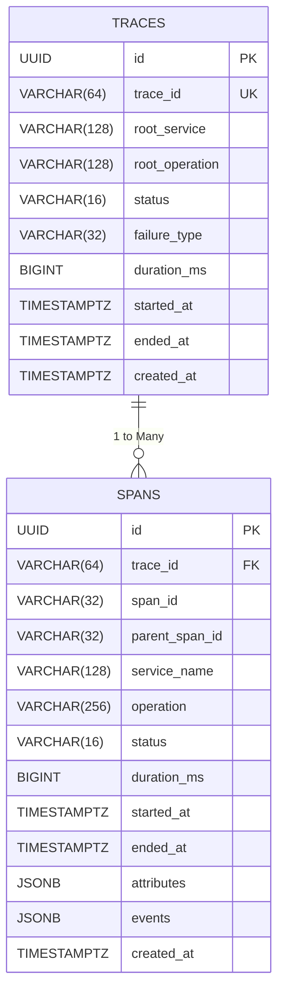
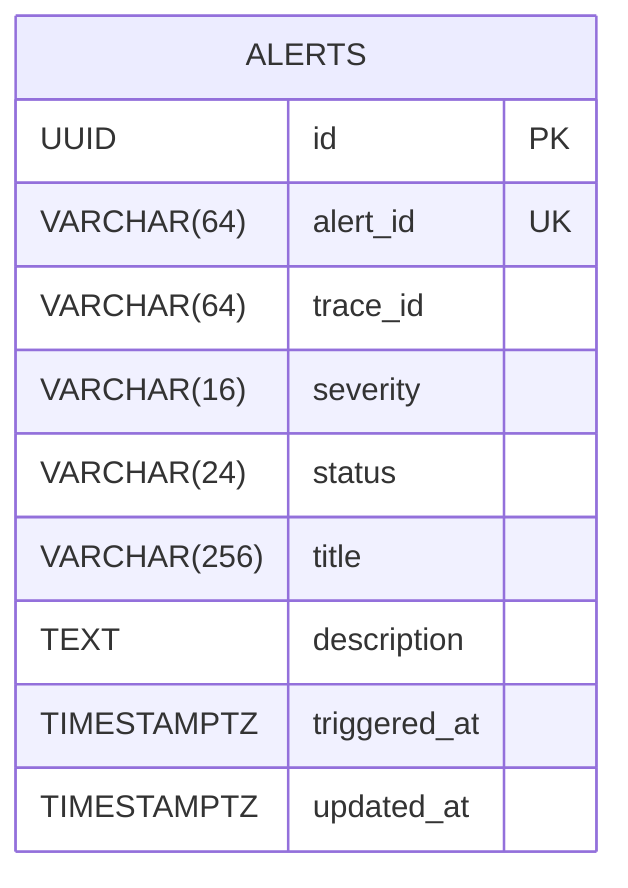
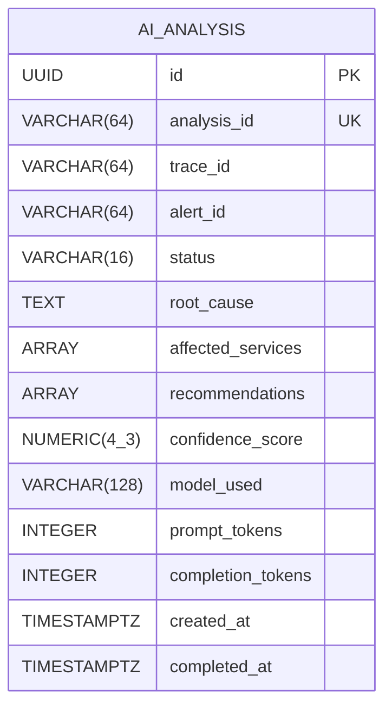

# DATABASE ANALYSIS

This document provides a detailed breakdown of all databases, tables, and relationships within the Incident Commander AI architecture. It is strictly based on the provided Flyway SQL migrations and SQLAlchemy ORM models.

## Overview & Ownership

The system strictly follows the **Database-per-Service** pattern using PostgreSQL 16. Services only access their respective databases. There are no cross-database foreign keys. 

| Database / Schema | Owning Service | Migration / ORM Location |
|---|---|---|
| `incidents_db` (Traces) | `trace-service` | `V1__create_trace_tables.sql` |
| `alerts_db` (Alerts) | `alert-service` | `V2__create_alerts.sql` |
| `ai_db` (AI Analysis) | `ai-analytics-service` | SQLAlchemy (`database.py`) |

> **NOT FOUND IN CODEBASE:** The README mentions `incidents-init.sql` and `ai-init.sql` (for pgvector). However, there is no vector data in the SQLAlchemy models, and the `incident-service` does not exist. The only AI table present is `ai_analysis`.

---

## 1. Trace Service Database

### Entity Relationship Diagram

### Table Details
#### `traces`
* **Purpose:** Stores the root-level aggregate of a distributed trace.
* **Constraints:** `PRIMARY KEY (id)`, `UNIQUE (trace_id)`.
* **Indexes:** `idx_traces_trace_id`, `idx_traces_status`, `idx_traces_started_at`.
* **Persistence Behavior:** The `trace_id` is the business key linking across all microservices.

#### `spans`
* **Purpose:** Stores the individual units of work within a trace.
* **Constraints:** `PRIMARY KEY (id)`, `FOREIGN KEY (trace_id) REFERENCES traces(trace_id)`.
* **Indexes:** `idx_spans_trace_id`, `idx_spans_span_id`.
* **Data Types:** Uses `JSONB` for `attributes` and `events` to store flexible, unstructured OpenTelemetry key-value pairs natively without requiring EAV tables.

---

## 2. Alert Service Database

### Entity Relationship Diagram

### Table Details
#### `alerts`
* **Purpose:** Tracks actionable operational incidents generated from traces.
* **Constraints:** `PRIMARY KEY (id)`, `UNIQUE (alert_id)`. `trace_id` is a soft foreign key referencing the `traces` table in the Trace Service.
* **Indexes:** `idx_alerts_alert_id`, `idx_alerts_trace_id`, `idx_alerts_status`, `idx_alerts_severity`, `idx_alerts_triggered_at (DESC)`.
* **Defaults:** `status` defaults to `'OPEN'`. `triggered_at` and `updated_at` default to `NOW()`.

---

## 3. AI Analytics Service Database

### Entity Relationship Diagram

### Table Details
#### `ai_analysis`
* **Purpose:** Caches and persists the output of Anthropic Claude LLM analysis.
* **Constraints:** `PRIMARY KEY (id)`, `UNIQUE (analysis_id)`. `trace_id` and `alert_id` are soft foreign keys.
* **Indexes:** `idx_ai_analysis_trace_id`, `idx_ai_analysis_status` (generated by SQLAlchemy `index=True`).
* **Data Types:** Uses PostgreSQL `ARRAY(Text)` for `affected_services` and `recommendations`. Uses `NUMERIC(4, 3)` for `confidence_score`.
* **Persistence Behavior:** Created immediately upon triggering with status `PENDING`, and updated asynchronously when the LLM responds. Tracks token usage for billing monitoring.
