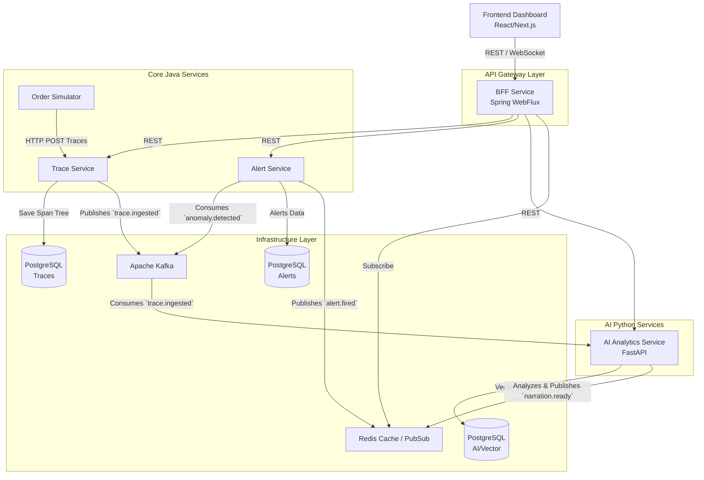
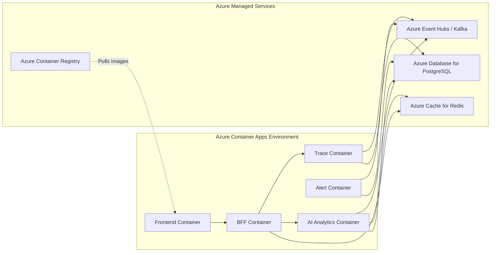
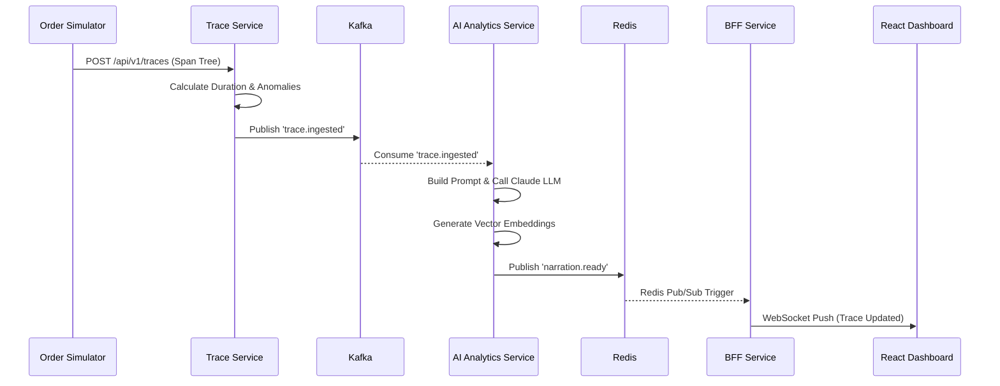

# PROJECT OVERVIEW

## Executive Summary
**Incident Commander AI** is an AI-powered production incident management platform. It acts as an automated first responder to ingest distributed microservice traces, identify anomalies, and perform root-cause analysis using a multi-agent AI pipeline. By replacing manual log searching and dashboard scanning with real-time semantic analysis and LLM-driven postmortems, it vastly accelerates Mean Time To Resolution (MTTR).

## Project Purpose & Business Problem Solved
Large engineering teams typically lose significant time manually searching logs, metrics, dashboards, and historical tickets during production incidents. This project solves this operational bottleneck by:
1. Automating the ingestion and analysis of trace spans.
2. Detecting statistical anomalies in real-time.
3. Automatically identifying the root cause and impacted upstream/downstream services.
4. Auto-generating postmortem reports using retrieval-augmented generation (RAG) based on historical incident data.
5. Providing an interactive dashboard with real-time websocket pushes for critical alerts.

## Target Users
- **Site Reliability Engineers (SREs)**
- **DevOps Engineers**
- **On-Call Software Engineers**
- **Engineering Managers** reviewing postmortem metrics.

## Major Capabilities
- **Distributed Trace Ingestion:** Walking span trees, computing durations, detecting error status.
- **Statistical Anomaly Detection:** Real-time baseline calculation and Z-score statistical evaluation.
- **Multi-Agent Root Cause Analysis:** Leveraging Anthropic Claude (via API) to translate raw span trees into human-readable narratives.
- **Rules-Based Alerting:** Evaluating anomalies against thresholds and firing severity-ranked alerts.
- **Real-Time Dashboarding:** Visualizing DAG service graphs, span waterfalls, and live alert banners using React and WebSockets.
- **Similar Incident Vector Search:** Using pgvector to store and retrieve semantically similar past incident resolutions.

## Architecture Style
**Event-Driven Microservices Architecture.**
The application relies heavily on Apache Kafka as a central nervous system for durable, replayable, and ordered event delivery between services, decoupling ingestion from analysis and alerting.

## Deployment Style
**Containerized Serverless.**
Configured for deployment via Docker and optimized for **Azure Container Apps**, which provides managed autoscaling and ingress without the overhead of maintaining a Kubernetes control plane.

---

## Complete Folder Hierarchy & Service Structure

```
incident-commander-ai/
├── ai-analytics-service/       # Python FastAPI (Narration & Anomaly Detection)
├── alert-service/              # Java Spring Boot (Rules-based alerting)
├── bff-service/                # Java Spring WebFlux (API Gateway & WebSocket relay)
├── frontend/                   # React Next.js SPA (Dashboard)
├── order-simulator/            # Java Spring Boot (Demo load generator)
├── trace-service/              # Java Spring Boot (Ingestion & Span parsing)
├── docker-compose.yml          # Local infra definition (Postgres, Kafka, Redis)
└── seed-demo.sh                # Test data generation script
```

---

## Technology Stack Inventory

### Backend Technologies (Java & Python)
- **Java 17+**
- **Spring Boot 3.2.x:** Core backend framework.
- **Spring WebFlux:** Reactive API Gateway in the BFF service for non-blocking parallel fan-out calls.
- **Spring Data JPA:** Relational data mapping.
- **Python 3.9+**
- **FastAPI (0.115.6):** High-performance async Python web framework for AI services.
- **SQLAlchemy (2.0.50):** Python ORM.
- **Pydantic (2.13.4):** Data validation and serialization in Python.

### Frontend Technologies
- **React 18:** UI library.
- **Next.js (14.2.3):** React framework for routing and rendering.
- **TailwindCSS (3.4.1):** Utility-first styling.
- **Framer Motion:** Micro-animations and transitions.
- **TanStack React Query:** Server-state management and caching.
- **Zustand:** Local state management (evidence found in `package.json` and README).
- **React Flow / Recharts:** Visualization for DAG graphs and span waterfalls.
- **STOMP.js:** WebSocket protocol handling.

### Infrastructure & Data Services
- **PostgreSQL 16:** Primary relational database (Database-per-service pattern).
- **pgvector:** PostgreSQL extension for semantic vector similarity search.
- **Apache Kafka (3.7):** Central event bus (`apache/kafka:latest`).
- **Redis (7-alpine):** Fast caching layer and pub-sub relay for WebSockets.
- **Docker & Docker Compose:** Containerization and local orchestration.

### Observability & Resilience
- **OpenTelemetry:** Distributed tracing instrumentation.
- **Resilience4j:** Circuit breakers preventing cascading failures on LLM API calls.
- **Kafka-UI:** Local observability into topics and consumer groups.

### AI / LLM Frameworks
- **Anthropic Claude API:** Backend LLM for parsing span trees into narratives and root causes.
- **Spring AI:** Direct LLM integration from Java services.

---

## Architecture Diagrams

### High-Level Architecture (HLD)



### Component Deployment Diagram



### Request Flow Diagram: Trace Ingestion to Alert



> **Note:** The above data is statically extracted from `.env.example`, `docker-compose.yml`, `README.md`, `pom.xml`, and `requirements.txt`.
